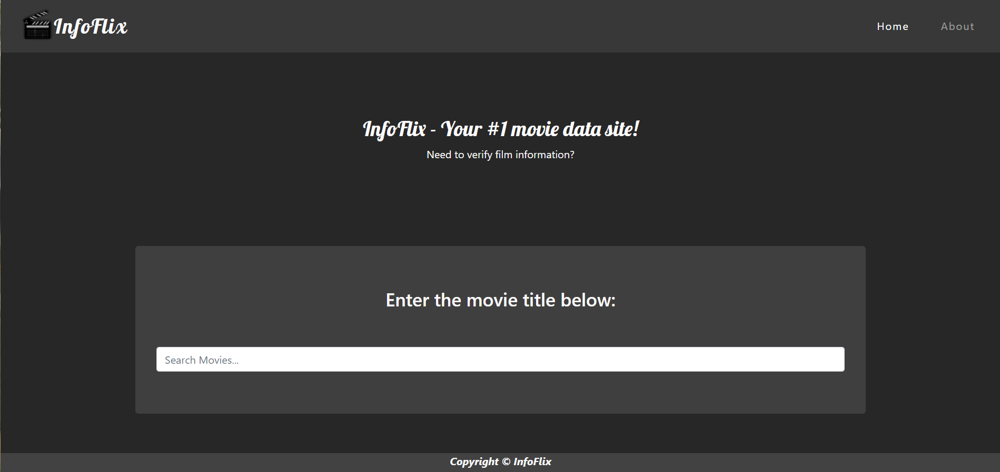

# InfoFlix
-----------
-----------

**Spending the weekend inside? You ran out of movies to watch on Netflix? Look no further, InfoFlix has the largest movie database in the world... Oh, It's free too ;)**

## Project Discription
I personally watch a lot of movies and television (before studying fulltime). At least once a week, my partner and I would have to jump site to site to find something new to watch... We grew tired of this, and in some cases, would find something else to do! But now that I have learned how to build web apps, why not build something I can use? So here's where my second Milestone project comes into play. This web page will gather movie information from an API and display the data in a similar fashion to the well known web site IMDb.

## Project Requirements 

1. **Main Technologies**   
    - [x] *HTML5* (Required)  
    - [x] *CSS3* (Required)  
    - [x] *Bootstrap*  
    - [x] *JavaScript* (Required)  
    - [x] *jQuery*  
    - [x] *External API's*  

## Mandatory Requirements
A project violating any of these requirements will FAIL

1. **Dynamic Front End Project**   
    - [x] *Write custom JavaScript, HTML and CSS code to create a front-end web application consisting of one or more HTML pages with significant interactive functionality.* 
2. **Site Responses**   
    - [x] *Use JavaScript to have the site produce relevant responses dependent on users' actions.*
3. **Information Architecture**   
    - [x] *Incorporate a main navigation menu (unless irrelevant) and structured layout (you might want to use Bootstrap to accomplish this).*  
4. **Documentation**   
    - [x] *Write a README.md file for your project that explains what the project does and the value that it provides to its users.*
5. **Version Control**   
    - [x] *Use Git & GitHub for version control.*
6. **Attribution**   
    - [x] *Maintain clear separation between code written by you and code from external sources (e.g. libraries or tutorials). Attribute any code from external sources to its source via comments above the code and (for larger dependencies) in the README.*
7. **Deployment**   
    - [x] *Deploy the final version of your code to a hosting platform such as GitHub Pages.*

## Built With
This section lists the frameworks I used to built this project.
* [HTML](https://en.wikipedia.org/wiki/HTML)
* [CSS](https://en.wikipedia.org/wiki/CSS)
* [Bootstrap](https://getbootstrap.com)
* [jQuery](https://jquery.com/)
* [Axios](https://www.npmjs.com/package/axios)
* [Google Fonts](https://fonts.google.com/)
* [Balsamiq](https://balsamiq.com/)

## UX/UI
Bootstrap played a major role in holding everything together and providing ease of use. The site is laid of so that the user would understand how to access the provided information. How to use labels are in all the headings of the main page.

## Acknowledgements
* [OMDb API - The Open Movie Database](http://www.omdbapi.com/)
* [whatismymovie - The site which inspired this project](https://www.whatismymovie.com/)

### Live
[*Click me to view site*](https://randyaajr.github.io/InfoFlix_Milestone-2/)